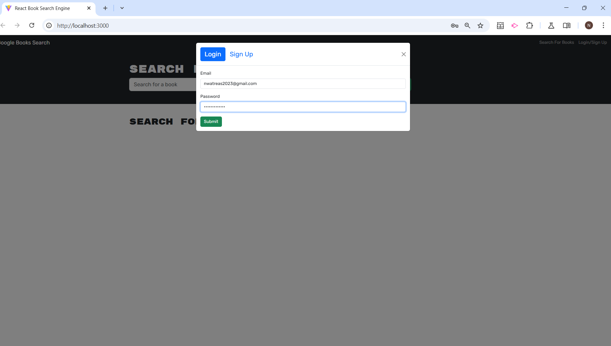
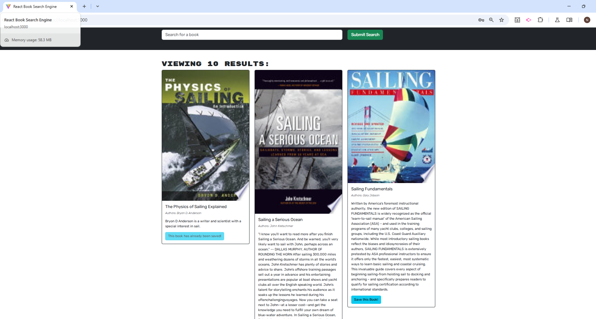
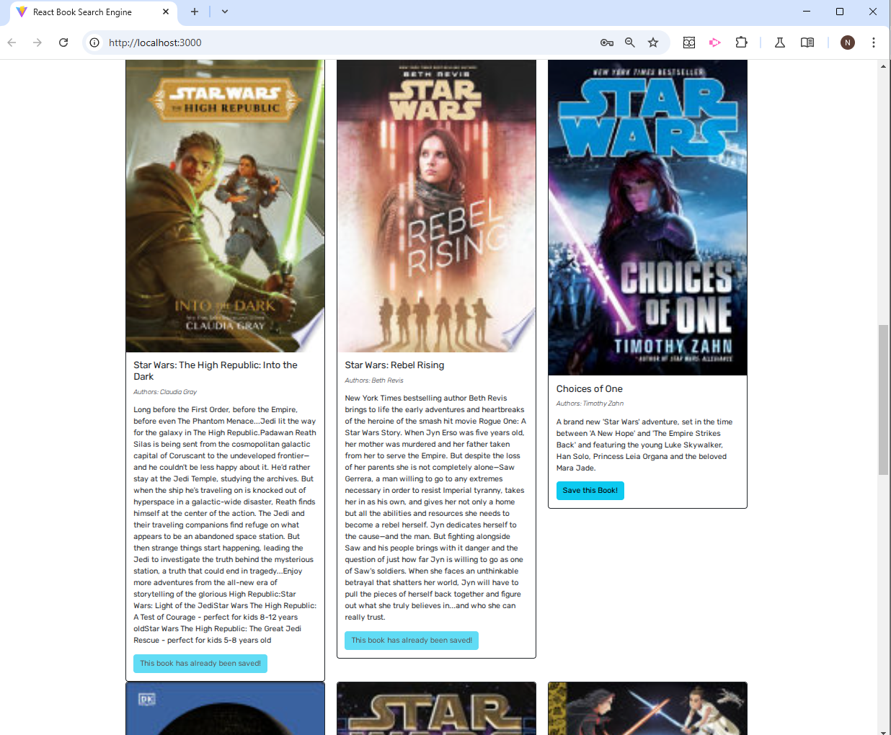
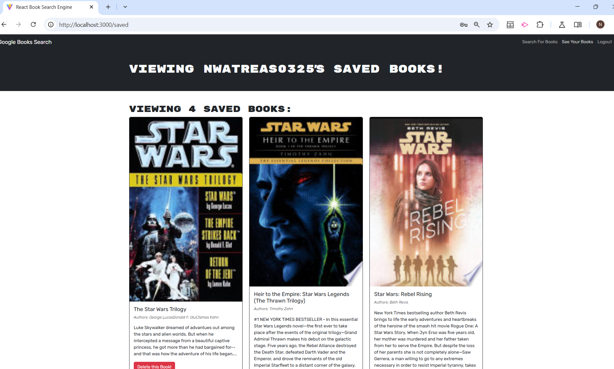

# A MERN Stack Book Search Engine with GraphQL API built with Apollo Server

## Website Links: 
- [github]https://github.com/noIDEA-tech/graphql-server-Book-Search-Engine
- [website]https://graphql-server-book-search-engine.onrender.com

## Description
This application is a book search engine which allows users to create a user profile by entering their email address and creating a password in the pop-up modal. Once a profile has been created, users can conduct book searches by entering a book title, author, topic, or other related input into the "Search for book" field and clicking on the "Submit Search" botton. Users can then browse through pages of books with the option to click on "Save this Book!", if they want to add it to their profile. Users may also click on the "See Your Books" link, located on the navigation bar to manage their collection of saved books. They also have the option to delete any book saved in their profile. Upon completing a book search, users may then log out by clicking on the "Logout" function also located on the navigation bar. 

## Table of Contents
- [Features](#features)
- [Installation](#installation)
- [Usage](#usage)
- [Tests](#tests)
- [Issues](#issues)
- [License](#license)
- [Credits](#credits)
- [Contact](#contact)

## Features:
- Book Search Engine using Google API
- User authentication with JWT
- Search, save and delete books

## Installation
To run this application locally, you'll need to install:

### Server Dependencies:
- Node.js and npm
- MongoDB (local installation or Atlas account)
- Express.js
- Apollo Server (@apollo/server)
- GraphQL
- JWT for authentication
- Mongoose

### Client Dependencies:
- React
- Apollo Client (@apollo/client)
- GraphQL
- React Router
- Bootstrap (or React Bootstrap)

### Steps to Install:
1. Clone the repository: 
    - `git clone https://github.com/yourusername/graphql-server-book-search-engine.git`

2. Install server dependencie: 
    - cd server `npm install`

3. Install client dependencies: 
    - cd ../client `npm install` 

4. Set up environment variables: Create a .env file in the server directory with: 
    - JWT_SECRET_KEY=your_secret_key
    - MONGODB_URI=your_mongodb_connection_string (for production)
    
5. Run the application in development mode
    - `npm run develop`

## Usage:
- cd server  `npm run watch` 
- cd client  `npm run dev`

## Tests:
- From your root directory terminal, run the following commands:
    - cd server: `npm run watch` 
    - cd client: `npm run dev`

## Issues:
- Ensuring proper endpoint connections during refactoring
- Proper JWT authentication configuration

## License
MIT

## Credits:
- Nancy Watreas
- AI assistance provided by Anthropic's Claude for debugging, code review, and deployment preparation. 

## Contact Info:
If there are any questions or concerns, I can be reached at:
##### [github: noIDEA-tech](https://github.com/noIDEA-tech)
##### [email: nwatreas2023@gmail.com](mailto:nwatreas2023@gmail.com)
